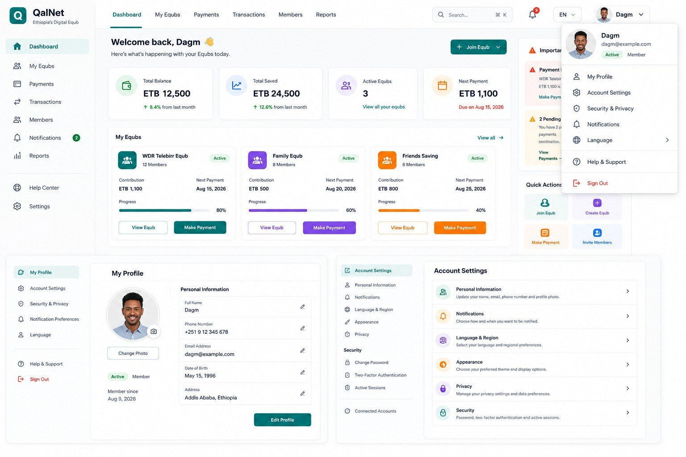

# QalNet Dashboard Design

## QalNet --- Ethiopia's Digital Equb

The following is the provided QalNet dashboard design reference.

------------------------------------------------------------------------

## Dashboard Elements

-   QalNet logo and branding
-   Dashboard navigation
-   My Equbs
-   Payments
-   Transactions
-   Members
-   Notifications
-   Reports
-   Help Center
-   Settings
-   Search
-   Language selector
-   User profile and profile dropdown
-   Total Balance
-   Total Saved
-   Active Equbs
-   Next Payment
-   My Equbs cards
-   Payment actions
-   Quick Actions
-   My Profile
-   Account Settings
-   Security & Privacy
-   Notification Preferences
-   Language
-   Appearance
-   Privacy
-   Security
-   Two-Factor Authentication
-   Active Sessions
-   Connected Accounts

## Reference Data Shown

### Dashboard

-   User: Dagn
-   Email: dagm@example.com
-   Status: Active
-   Role: Member
-   Total Balance: ETB 12,500
-   Total Saved: ETB 24,500
-   Active Equbs: 3
-   Next Payment: ETB 1,100
-   Next payment due: Aug 15, 2026

### Equbs

1.  **WDR Telebirr Equb**
    -   12 Members
    -   Contribution: ETB 1,100
    -   Next Payment: Aug 15, 2026
    -   Progress: 80%
2.  **Family Equb**
    -   8 Members
    -   Contribution: ETB 500
    -   Next Payment: Aug 20, 2026
    -   Progress: 60%
3.  **Friends Saving**
    -   6 Members
    -   Contribution: ETB 800
    -   Next Payment: Aug 25, 2026
    -   Progress: 40%

### Profile

-   Full Name: Dagn
-   Phone Number: +251 9 12 345 678
-   Email Address: dagm@example.com
-   Date of Birth: May 15, 1996
-   Address: Addis Ababa, Ethiopia
-   Member since: Aug 9, 2026

## Design Notes

-   Modern fintech dashboard
-   Clean white background
-   Rounded cards
-   Light gray borders
-   Teal/green primary color
-   Purple, blue, orange and green accent colors
-   Professional financial application appearance
-   Desktop dashboard layout
-   Responsive design recommended
